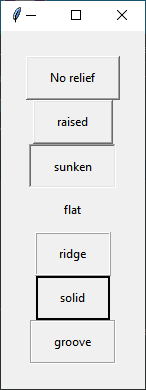

# Relief (Estilo da borda)

Valores para o estilo da borda podem ser **raised**, **sunken**, **flat**, **ridge**, **solid**, e **groove**.

Na próxima imagem eu vou mostrar um exemplo de cada.

Como visto, o padrão é raised.